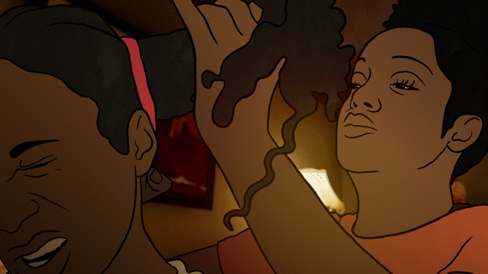

<nav class="custom-nav">
  <a href="./" class="nav-link">Home</a>
  <a href="motion-graphics.html" class="nav-link">Motion Graphics</a>
  <a href="compositing.html" class="nav-link">2D Compositing</a>
  <a href="programming.html" class="nav-link">Unity Programming</a>
</nav>

  

  

    

      

        <h2>Do No Harm (The Opioid Trilogy | PBS)</h2>
        
The story of Raina, who spent 17 years battling heroin addiction before finding her healing path through alternative approaches.

        
<strong>Role:</strong> Lead Compositor.

        
<strong>Software:</strong> After Effects

      

      

        <iframe width="560" height="315" src="https://www.youtube.com/embed/8qQw2yy9p20?si=eg8-K_5_1XqCufUp" title="YouTube video player" frameborder="0" allow="accelerometer; autoplay; clipboard-write; encrypted-media; gyroscope; picture-in-picture; web-share" referrerpolicy="strict-origin-when-cross-origin" allowfullscreen></iframe>
      

    

  

  

    

      

        <h2>Coming Home (The Opioid Trilogy | PBS)</h2>
        
Compositing together line work and textures to tell the story of a recovering addict who aims to help others find their way.

        
<strong>Role:</strong> Lead Compositor.

        
<strong>Software:</strong> After Effects

      

      

        <iframe width="560" height="315" src="https://www.youtube.com/embed/JZYJ_1wpqNQ?si=KFd-bjF4DCCSqyg0" title="YouTube video player" frameborder="0" allow="accelerometer; autoplay; clipboard-write; encrypted-media; gyroscope; picture-in-picture; web-share" referrerpolicy="strict-origin-when-cross-origin" allowfullscreen></iframe>
      

    

  

  

    

      

        <h2>Addiction Animated (The Opioid Trilogy | PBS)</h2>
        
The first entry in The Opioid Trilogy, highlighting phone calls between the filmmaker and her brother as he battles against his addiction.

        
<strong>Role:</strong> Lead Compositor.

        
<strong>Software:</strong> After Effects

      

      

        <iframe width="560" height="315" src="https://www.youtube.com/embed/LBC7FfG1hc0?si=VmHgtdKjbmFOx1ZI" title="YouTube video player" frameborder="0" allow="accelerometer; autoplay; clipboard-write; encrypted-media; gyroscope; picture-in-picture; web-share" referrerpolicy="strict-origin-when-cross-origin" allowfullscreen></iframe>
      

    

  

  <a class="prev" onclick="changeSlide(-1)">&#10094;</a>
  <a class="next" onclick="changeSlide(1)">&#10095;</a>

## 2D compositing work

  

    
  

  

    
  

  

    
  

  

    
  

  

    
  

  

    
  

  

    
  

  

    
  

  

    
  

## Javascript

